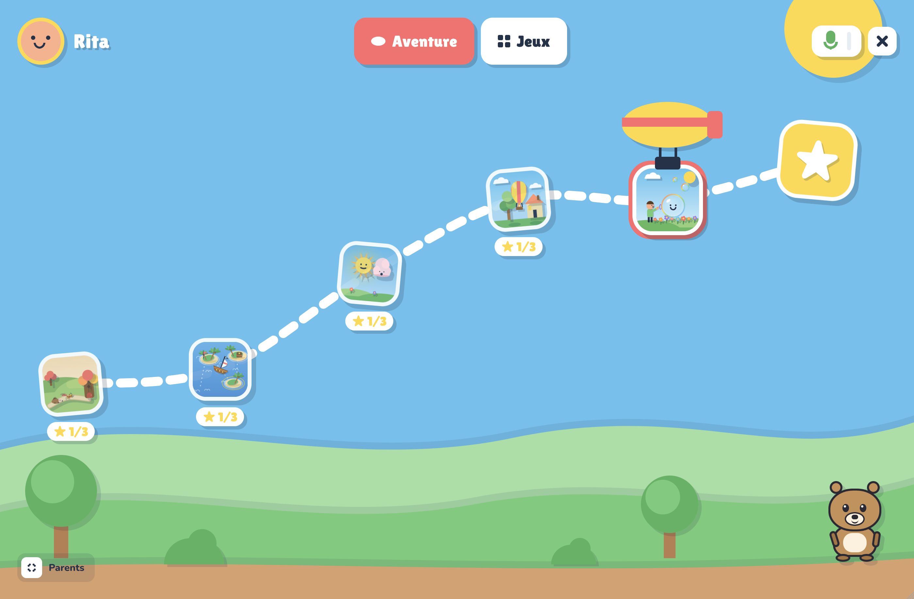
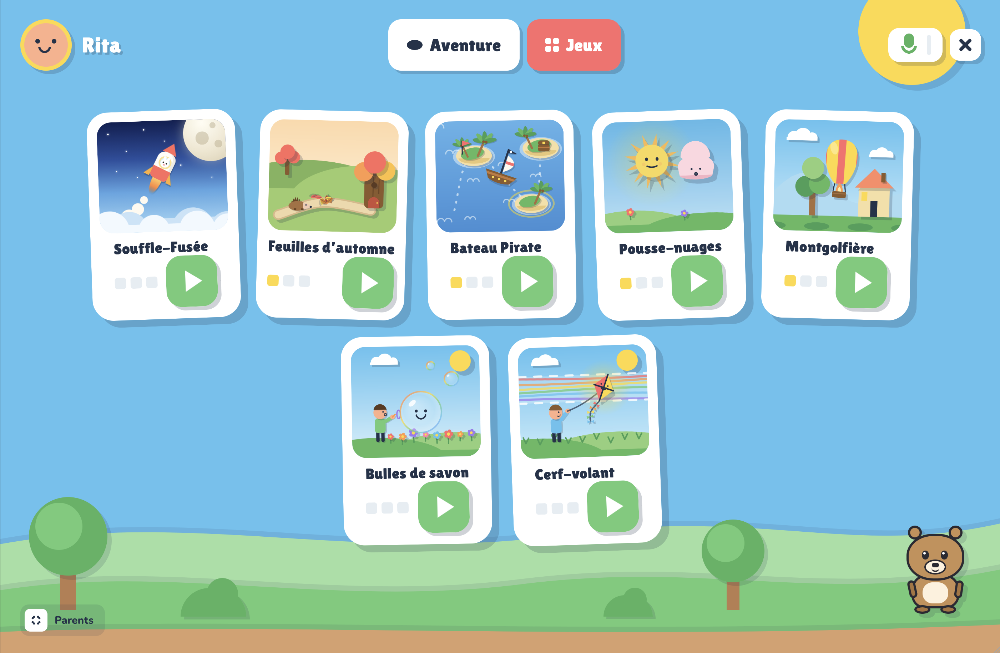
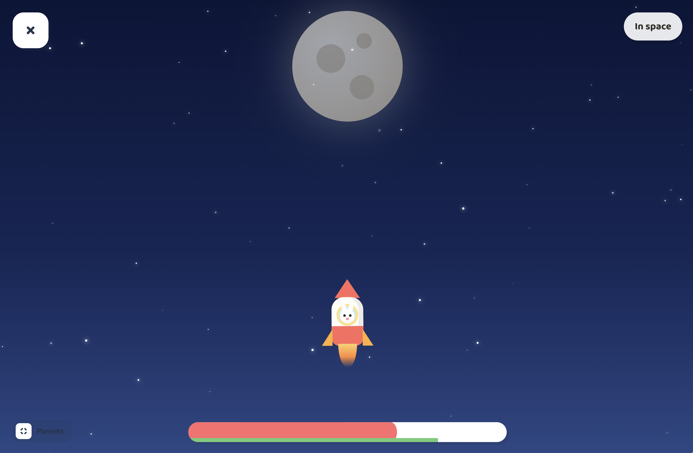
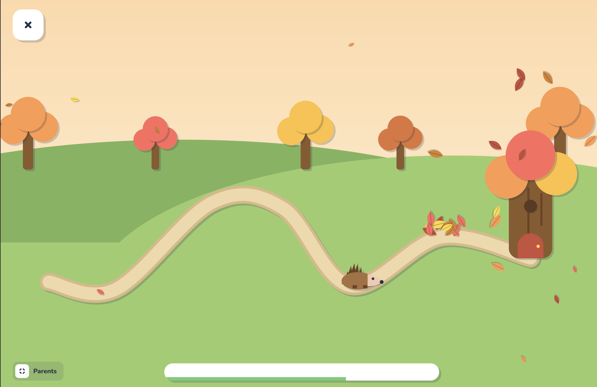

# Souffle Aventure

A platform of breath-controlled therapeutic games for children aged 3 to 6.
Landscape tablet (1024×640) first, portrait mobile supported.
Design: the "cut paper" direction (Claude Design, `Souffle Aventure.dc.html`).



```sh
pnpm install
pnpm dev        # http://localhost:5173
pnpm build      # tsc + vite → dist/
pnpm lint
pnpm test       # vitest: cross-game difficulty balance
```

## Flow

Home (profile) → Calibration (every session, ~5 s)
→ Adventure map → Game → back to the map (stars, and the balloon flying to the
next step). Games tab → Game (`?mode=free`) → Reward → next level of the same game.



## Architecture

```
src/
  breath/      breath engine (Web Audio mic, keyboard/finger fallback, calibration, events)
  games/       ← ADD A GAME HERE — see src/games/README.md
  adventure/   builds the adventure path from the registry
  store/       profiles, progress, sessions (localStorage, useSyncExternalStore)
  components/  ui (cut-paper kit) · game (GameShell: HUD, stats, result)
  screens/     one file per screen
  styles/      tokens.css (palette, shadows, type) · global.css
```

### Adding a game

1. `cp -r src/games/_template src/games/my-game`
2. Fill in `index.ts` (`defineGame({...})`) and write `Game.tsx`.
3. That's all: the registry (`import.meta.glob`) discovers it, the Games tab
   and the adventure map include it, progress and the parents area follow.

Contract details (`GameProps`, breath, levels): `src/games/README.md`.

Games:

- **Souffle-Fusée** (`src/games/souffle-fusee/`) — the first real game, ported
  from the "Souffle-Fusée" and "Blast Off - Screens" designs. DOM rendering
  driven by refs in a rAF loop; 3 levels (base altitude, reference time for the
  stars). End of game: landing on the round Moon, then a celebration (a lap
  around the Moon with a trail, rings, confetti) before the reward screen.

  

- **Bulles de savon** (`src/games/bulles-de-savon/`) — canvas 2D. One long,
  steady breath inflates a bubble on the wand; variations make it wobble and
  slow its growth, too strong a breath (above the threshold, 250 ms) pops it,
  and stopping the breath releases it. Bubbles that reach the target circle go
  and line up in the top right; at the end they burst into confetti. 3 levels
  (1.5 / 2.5 / 3.5 s of breath, 3 / 4 / 5 bubbles); stars: 3 with no popped
  bubble, 2 up to two, otherwise 1.
- **Bateau Pirate** (`src/games/bateau-pirate/`) — a treasure map on canvas 2D
  (`draw.ts` shared with the thumbnail). Each breath fills the sail and pushes
  the boat along a dotted route passing under the islands; it glides, slows
  down, moors in front of each island (flag planted) and the celebration starts
  at the chest (coins, rings). 3 levels (3, 4, 5 islands).
- **Montgolfière** (`src/games/montgolfiere/`) — horizontal scrolling on canvas
  2D. A sustained breath lights the burner and lifts off; the balloon then moves
  on its own near the ground and each breath makes it rise to fly over trees,
  rocks, houses and towers. Impacts shake the obstacle and cost stars (3 without
  an impact, 2 up to two impacts, otherwise 1). Arrival: descent onto the
  platform, flag raised, confetti. 3 levels (6, 9, 12 obstacles).
- **Pousse-nuages** (`src/games/pousse-nuages/`) — canvas 2D. The sun sulks
  behind a grumpy cloud (four silhouettes and six colours rotating); each breath
  pushes the cloud to the right, it glides then drifts gently back towards the
  sun (depending on difficulty). A long breath runs out of steam (full push up
  to 0.7 s, then decreasing): it's repeated short breaths that work. Cloud
  chased away → a flower blooms, the next one arrives; at the end, a big smiling
  sun and a rain of petals. 3 levels (3, 5, 8 clouds), stars on time.
- **Cerf-volant** (`src/games/cerf-volant/`) — canvas 2D. The kite's altitude
  follows the strength of the breath (gentle = low, strong = high) with a little
  inertia. A rainbow wind band shows the zone to hold; a ring around the kite
  fills while it stays there (and erodes slowly outside), stars streak through
  and get collected. Zone held → the band changes altitude; at the end, the kite
  climbs all the way up under the confetti. 3 levels (band 0.5 / 0.35 / 0.25,
  hold 3 / 4 / 5 s, 3 / 3 / 4 targets), stars based on efficiency (time in the
  zone / total time).
- **Feuilles d'automne** (`src/games/feuilles-d-automne/`) — canvas 2D, free
  breathing. A hedgehog follows a winding path towards its burrow at the foot of
  a tree; piles of leaves block the way. Any breath sends the leaves flying (in
  proportion to the intensity); pile cleared, it sets off again. Once there, it
  goes in, the window lights up, hearts rise. 3 levels (3 / 5 / 7 piles of 12 /
  14 / 16 leaves), stars based on time.

  

### Breath

- `MicBreathSource`: RMS after a 1.2 kHz low-pass, ~60 Hz.
- `KeyboardBreathSource`: Space or a held finger (dev / no mic).
- `BreathEngine`: normalization against the calibration (ambient noise / max
  breath), attack/release smoothing, hysteresis → `blowStart` / `blowEnd`.
- The choice of source and of microphone (list of audio inputs, tracking
  plug/unplug) is in the parents area (long press on the button at the bottom
  left). The chosen mic is remembered (`settings.micDeviceId`); if it is
  unplugged, we fall back to the default mic.

### Global difficulty

A parents setting (1 = easy → 10 = hard), stored in `settings.difficulty` and
passed to each game via `GameProps.difficulty` (0..1). Each game interprets it
with its own level settings (the `tuning` function in its `rules.ts`).
Souffle-Fusée: distance to the Moon ×1 → ×2 and gravity 0.05 → 0.15. Bateau
Pirate: push per breath ÷1 → ÷1.8 and braking 0.975 → 0.955 per frame.
Montgolfière: obstacles ×1 → ×2.5 more numerous, ×1.15 → ×1.85 taller, closer
together (fixed speed). Pousse-nuages: push ÷1 → ÷2 and the cloud drifting back
towards the sun 0 → 0.1 px/frame. Cerf-volant: band ×1 → ×0.6 and hold ×1 →
×1.5. Bulles de savon: breath ×1 → ×1.6 and "too strong" threshold 0.95 → 0.8.
Feuilles d'automne: leaves per pile ×1 → ×2.2.

These settings are **balanced across games**: `pnpm test` simulates every level
of every game at every difficulty with a "typical child"
(`src/games/balance/`) and checks that the breath time required stays
comparable from one game to another, and rises with difficulty. See
`src/games/README.md` § 4.

### Per-game parents settings

A game may declare its own settings (`GameDefinition.settings`, helpers
`setting.range / toggle / choice`). They appear in the parents area under
"Réglages des jeux", are remembered in `gameSettings[gameId]` and arrive typed
in `GameProps.settings`. Example in `src/games/_template`. Souffle-Fusée
declares none: it depends only on the global difficulty.

### Data

Everything stays on the device (`localStorage`, key `souffle-aventure:v1`).
No medical data; the parents area shows stars, and the number and duration of
breaths per game.
